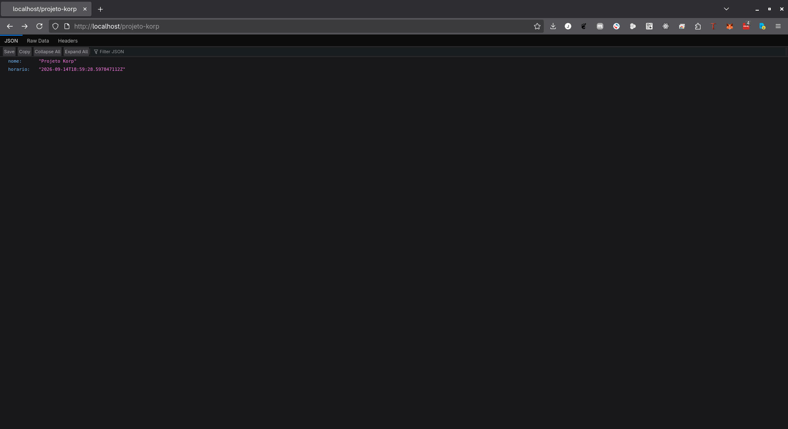
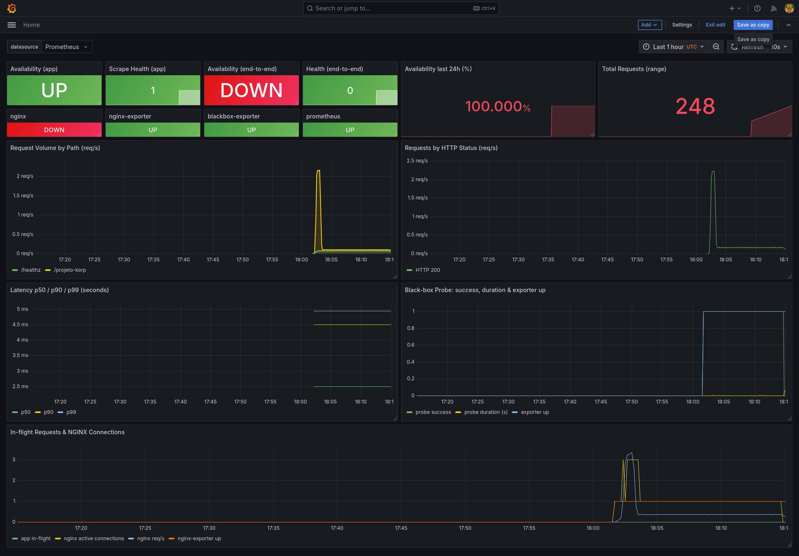
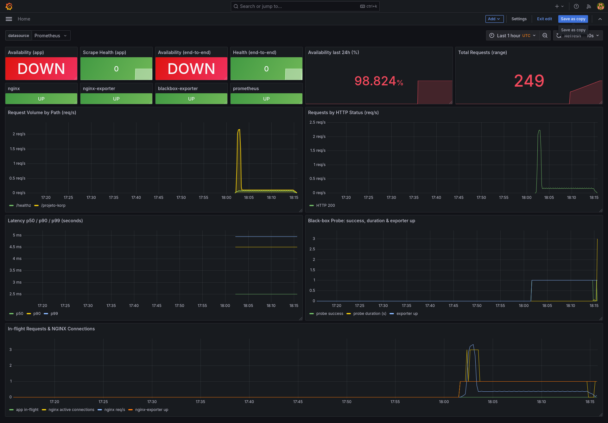
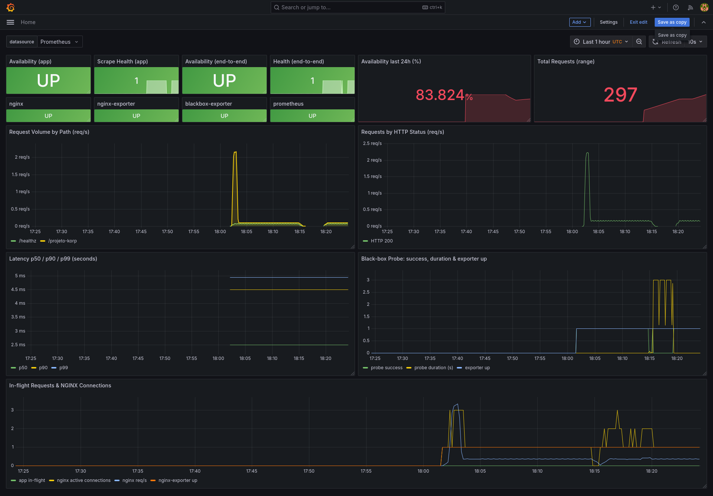

# Korp — DevOps Challenge

Golang HTTP service running in containers behind an NGINX reverse proxy, fully
instrumented with Prometheus + Grafana and provisioned end-to-end by a single
Ansible command.

| Component | Image / Language | Exposed on host |
|---|---|---|
| `http-server-projeto-korp` | Go 1.27 (distroless, non-root) | — (internal only) |
| `nginx` | `nginx:1.27-alpine` | `80` |
| `prometheus` | `prom/prometheus:v2.55.1` | `9090` |
| `grafana` | `grafana/grafana:11.3.1` | `3000` |
| `nginx-exporter` | `nginx-prometheus-exporter:1.3` | — |
| `blackbox-exporter` | `prom/blackbox-exporter:v0.25.0` | — |

---

## Architecture

```text
                       host:80
                          │
                    ┌─────▼─────┐        korp-net (bridge, 172.28.0.0/16)
                    │   nginx   │◄──────────────────────────────┐
                    └─────┬─────┘                               │
             proxy_pass   │ :8080                               │
                    ┌─────▼──────────────────────┐              │
                    │ http-server-projeto-korp   │              │
                    │  GET /projeto-korp         │              │
                    │  GET /healthz              │              │
                    │  GET /metrics              │              │
                    └─────▲──────────────────────┘              │
                          │ scrape                              │
                    ┌─────┴─────┐   query    ┌──────────┐       │
                    │ prometheus│◄───────────┤ grafana  │       │
                    └─────▲─────┘            └──────────┘       │
                          │ scrape                              │
              nginx-exporter / blackbox-exporter ───────────────┘
```

---

## Requirements

- Debian 14 (*Forky*) — also works on Trixie/Bookworm
- `sudo` privileges
- ansible-core ≥ 2.16 (or ansible ≥ 9)

---

## Quick start (Debian 14 / Forky)

### Step 1 — Clone the repository

```bash
sudo apt update
sudo apt install -y git
git clone https://github.com/JuniorPolegato/korp_challenge.git
cd korp_challenge
```

### Step 2 — Install Ansible and the Docker collection

```bash
sudo apt install -y ansible python3-docker
ansible --version
```

> **Note:** Debian's `ansible` package (14.0.0) already bundles
> `community.docker`. Only run
> `ansible-galaxy collection install community.docker` if you need a newer
> collection than the packaged one — it installs into `~/.ansible/collections`
> and **shadows** the system collections from then on.

---

### Step 3 — Docker (installed automatically by the playbook)

You do **not** need to install Docker by hand. The Docker tasks in `site.yml`.
takes care of:

- adding the official Docker GPG key to `/etc/apt/keyrings/`
- adding the APT repository, pinned to the **`trixie`** suite via
  `docker_apt_suite` (Docker does not publish a `forky` suite yet)
- installing `docker-ce`, `docker-ce-cli`, `containerd.io` and
  `docker-compose-plugin`
- enabling and starting the `docker` service
- adding your user to the `docker` group

Reference only — if you ever need to reproduce it manually:

```bash
sudo apt install -y ca-certificates curl gnupg
sudo install -m 0755 -d /etc/apt/keyrings
curl -fsSL https://download.docker.com/linux/debian/gpg \
  | sudo gpg --dearmor -o /etc/apt/keyrings/docker.gpg
sudo chmod a+r /etc/apt/keyrings/docker.gpg

# Forky has no Docker suite yet — pin to trixie
echo "deb [arch=$(dpkg --print-architecture) signed-by=/etc/apt/keyrings/docker.gpg] \
https://download.docker.com/linux/debian trixie stable" \
  | sudo tee /etc/apt/sources.list.d/docker.list > /dev/null

sudo apt update
sudo apt install -y docker-ce docker-ce-cli containerd.io docker-compose-plugin
sudo systemctl enable --now docker
sudo usermod -aG docker "$USER"
```

Confirm the pin resolved to the Docker repo and not to a Debian package:

```bash
apt policy docker-ce
```

---

### Step 4 — Provision the whole environment with a single command

```bash
cd ansible
ansible-playbook site.yml --ask-become-pass
```

> Remote host instead of localhost? Edit `ansible/inventory.ini` and run the
> exact same command.

**First run only** — activate your new `docker` group membership before the
verification steps below, otherwise `docker ps` fails with
`permission denied ... docker.sock`:

```bash
newgrp docker   # or log out and back in
docker ps
```

### Step 5 — Verify the containers

```bash
docker ps
docker network inspect korp-net --format '{{range .Containers}}{{.Name}} {{end}}'
```

### Step 6 — Test the endpoint through the reverse proxy

```bash
curl -s http://localhost:80/projeto-korp | jq .
```

```json
{
  "nome": "Projeto Korp",
  "horario": "2026-09-12T16:40:10.123456789Z"
}
```

Proof that the application port is **not** published to the host:

```bash
curl -s --max-time 3 http://localhost:8080/projeto-korp || echo "8080 is not exposed — correct"
```

### Step 7 — Inspect the raw metrics

```bash
docker exec -it nginx wget -qO- http://http-server-projeto-korp:8080/metrics | grep '^korp_'
```

### Step 8 — Prometheus targets

Open <http://localhost:9090/targets> — all five jobs must be `UP`.

### Step 9 — Grafana dashboard

1. Open <http://localhost:3000>
2. Log in with `admin` / `change-me` (see `.env`)
3. Dashboard **Projeto Korp → http-server-projeto-korp — Service Overview**
   is provisioned automatically and set as the home dashboard.

Generate some traffic first:

```bash
make load    # 500 requests
```

<table>
  <tr align="center">
    <td width="25%"><a href="docs/images/00-app.png"><br>Endpoint</a></td>
    <td width="25%"><a href="docs/images/01-grafana-availability.png"><br>NGINX DOWN</a></td>
    <td width="25%"><a href="docs/images/02-grafana-availability.png"><br>App DOWN</a></td>
    <td width="25%"><a href="docs/images/03-grafana-availability.png"><br>All UP</a></td>
  </tr>
</table>

---

## Endpoints

| URL | Purpose |
|---|---|
| `http://localhost/projeto-korp` | Challenge endpoint (JSON with dynamic UTC time) |
| `http://localhost/healthz` | Application health, proxied to the Go service |
| `http://localhost/health` | **NGINX-only** liveness, answered locally (`return 200`) |
| `http://localhost/nginx_status` | `stub_status`, restricted to Docker networks |
| `http://localhost:9090` | Prometheus |
| `http://localhost:3000/d/korp-service-dashboard` | Grafana dashboard |

`/health` and `/healthz` are deliberately separate: if `/health` answers but
`/healthz` fails, the fault is in the upstream, not in the proxy.

## Prometheus jobs

| Job | Target | Signal |
|---|---|---|
| `prometheus` | `localhost:9090` | self-monitoring |
| `http-server-projeto-korp` | `http-server-projeto-korp:8080/metrics` | white-box: availability + volume |
| `nginx` | `nginx-exporter:9113` | edge traffic |
| `blackbox-http-korp` | `http://nginx:80/projeto-korp` | end-to-end availability |
| `blackbox-http-nginx` | `http://nginx:80/health` | proxy liveness, isolated |

> `korp_service_up` is the *application's own* statement about its health, while
> `up{job="http-server-projeto-korp"}` is Prometheus' ability to scrape it, and
> `probe_success` is the client-perceived reality. The dashboard shows all three
> so the failure domain can be identified at a glance.

## Repository layout

~~~text
.
├── ansible/
│   ├── site.yml            # single-command provisioning
│   ├── ansible.cfg
│   ├── inventory.ini
│   └── group_vars/all.yml
├── app/                    # Go service + multi-stage Dockerfile
├── nginx/conf.d/http-server-projeto-korp.conf
├── monitoring/
│   ├── prometheus/prometheus.yml
│   └── grafana/provisioning/{datasources,dashboards}
├── scripts/teardown.sh
├── docs/images/
├── docker-compose.yml
├── .env.example            # copy to .env for manual `make up`
├── Makefile
└── README.md
~~~

----

## Metrics implemented

| Metric | Type | Meaning |
|---|---|---|
| `korp_service_up` | Gauge | **Availability** — `1` healthy, `0` draining/unhealthy |
| `korp_http_requests_total` | Counter | **Request volume** by `method`, `path`, `status` |
| `korp_http_request_duration_seconds` | Histogram | Latency distribution (p50/p90/p99) |
| `korp_http_requests_in_flight` | Gauge | Concurrent in-flight requests |
| `korp_build_info` | Gauge | Version metadata |
| `probe_success` | Gauge | Black-box availability through NGINX |
| `nginx_http_requests_total` | Counter | Edge request volume |

Useful PromQL:

```promql
# Availability over the last 24 hours (%)
avg_over_time(korp_service_up[24h]) * 100

# Request rate per endpoint
sum by (path) (rate(korp_http_requests_total[1m]))

# Error ratio
sum(rate(korp_http_requests_total{status=~"5.."}[5m]))
  / sum(rate(korp_http_requests_total[5m]))
```

---

## Manual operation (without Ansible)

```bash
cp .env.example .env    # required by docker compose
make up                 # build + start
make test               # curl the endpoint
make load               # 500 requests to populate the dashboard
make logs               # follow logs
make down               # stop
make clean              # containers + volumes + local image
make teardown           # full wipe, including network and /opt/projeto-korp
make reinstall          # teardown + provision from scratch
```

---

## `.env.example`

```dotenv
# Build/runtime variables consumed by docker-compose.yml
APP_VERSION=1.0.0
GRAFANA_ADMIN_USER=admin
GRAFANA_ADMIN_PASSWORD=change-me
PROMETHEUS_RETENTION=15d
```

---

## Design decisions

- **Multi-stage build + distroless/nonroot**: final image is a few MB, contains
  no shell or package manager, and runs as UID 65532 — minimal attack surface.
- **Static binary (`CGO_ENABLED=0`)**: no libc dependency at runtime.
- **`read_only: true`, `cap_drop: ALL`, `no-new-privileges`**: hardened runtime.
- **Application never publishes a port**: NGINX is the single ingress point,
  as required by the challenge.
- **`stub_status` + `nginx-exporter`**: request volume measured at the edge as
  well, so an app crash is still visible in the traffic graphs.
- **`blackbox-exporter`**: real end-to-end availability from an external
  perspective, complementing the white-box `korp_service_up`.
- **Fully provisioned Grafana** (`datasources.yml`, `dashboards.yml`,
  `*-dashboard.json`): dashboards are versioned as code, no manual clicks.
- **Idempotent Ansible with handlers**: re-running the playbook converges the
  environment instead of recreating it blindly.
- **Debian Forky note**: Docker does not publish an APT suite for `forky` yet,
  so the playbook automatically pins the repository to `trixie`.
- **Graceful shutdown**: on `SIGTERM` the service flips `korp_service_up` to 0,
  stops accepting traffic and drains open connections.

---

## Troubleshooting

| Symptom | Fix |
|---|---|
| `permission denied ... docker.sock` | `newgrp docker` or log out and back in |
| `port 80 already in use` | `sudo ss -tulpn \| grep :80` then stop the conflicting service |
| Prometheus target `DOWN` | `docker compose logs http-server-projeto-korp` |
| Empty dashboard | Generate traffic with `make load` |
| Docker repo 404 on Forky | Already handled by `docker_apt_suite`; verify with `apt policy docker-ce` |


---

**Author:** Claudio Polegato Junior · **Contact:** linux@juniorpolegato.com.br
